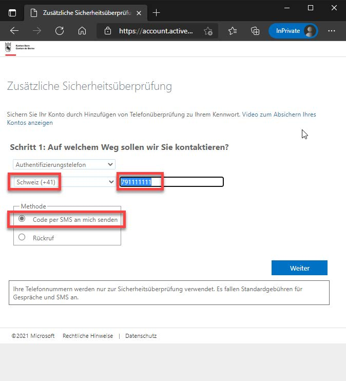
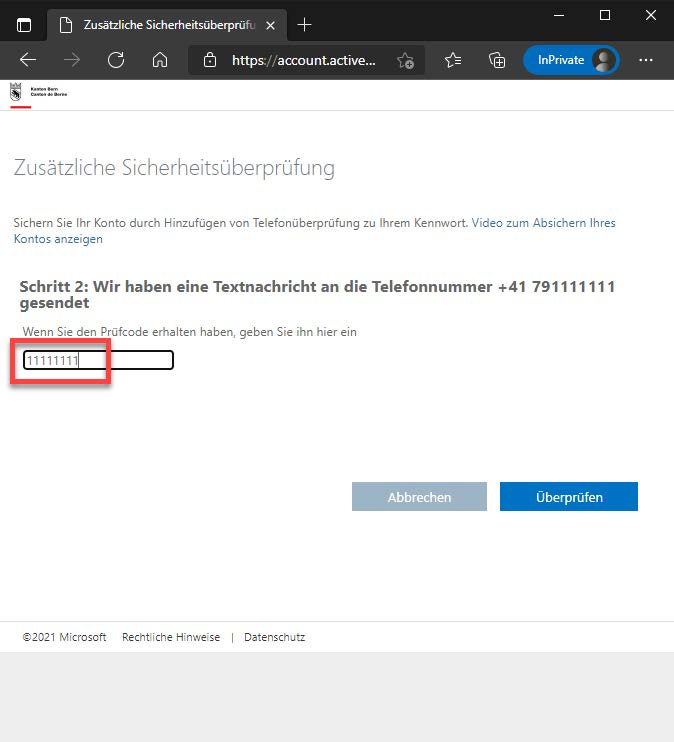
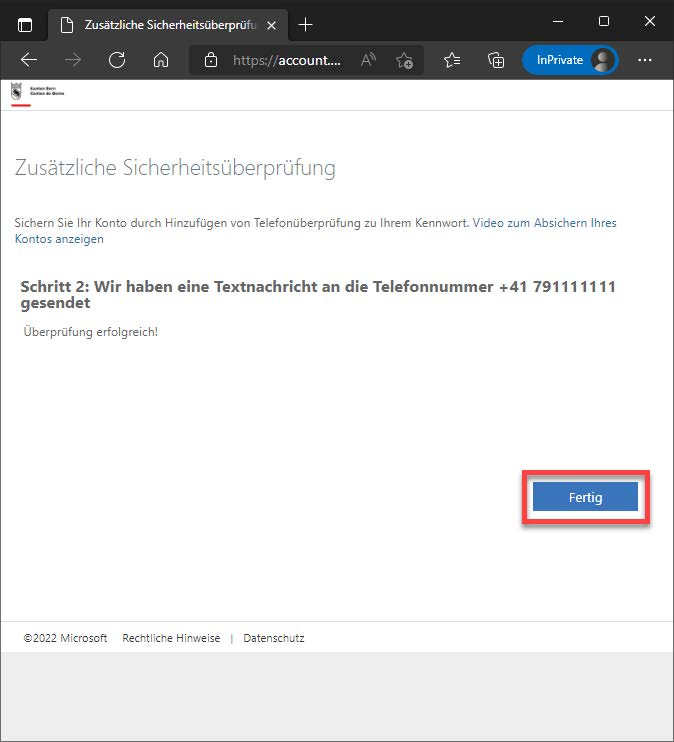
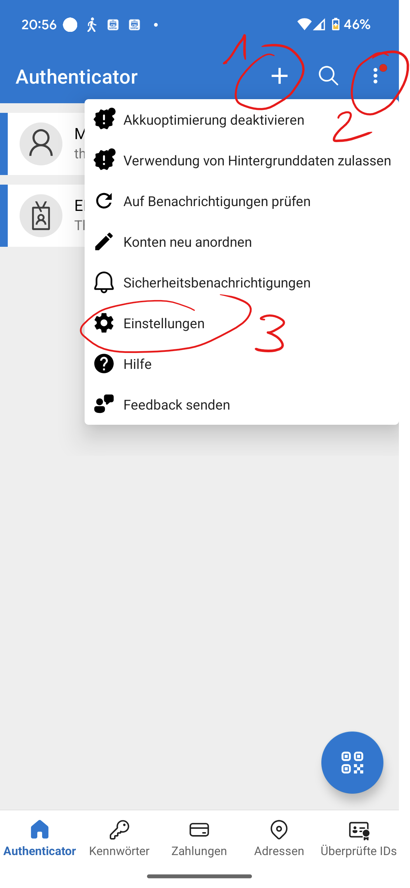
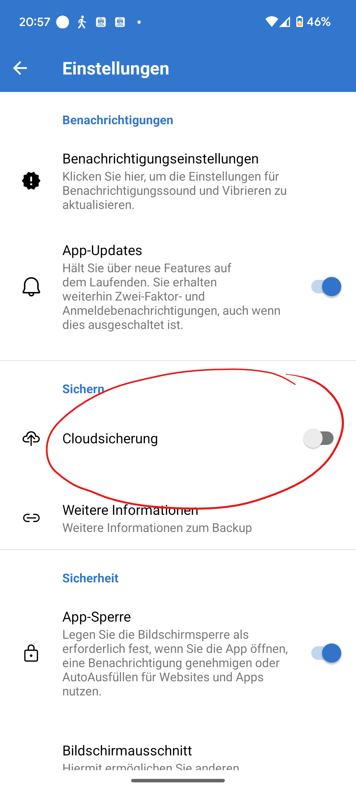

---

sidebar_custom_props:
  icon: mdi-two-factor-authentication
sidebar_position: 12
---

# Authentification Multi-Facteurs

<Features />

:::details[Qu'est-ce que MFA ?]
L'**authentification multi-facteurs** (abrégée __MFA__) sert à renforcer la sécurité. Si vous devez vous authentifier avec deux facteurs, par exemple, un ordinateur portable volé ne pourra pas être utilisé pour accéder à un compte. Tous les enseignants et élèves doivent configurer cela. Si vous êtes sur le réseau scolaire, l'adresse e-mail et le mot de passe suffisent, mais sinon, vous devez toujours vous authentifier à double facteur.
Tout d'abord, vous devez vous connecter avec l'adresse e-mail de l'école et votre mot de passe.
Ensuite, vous recevrez soit un SMS avec un code, soit un code dans votre application d'authentification.
:::
# Guide : Configuration

:::tip[Authentification par SMS]
Pour l'authentification à deux facteurs, un **numéro de téléphone mobile actif** doit être enregistré. D'autres options (application ou e-mail) peuvent être ajoutées en supplément.
:::

## Vérification et configuration des informations de sécurité par SMS

Pour utiliser le MFA, des informations de sécurité supplémentaires doivent être enregistrées pour la méthode de connexion.

### Étapes de configuration

1. Entrez l'adresse suivante dans votre navigateur :
   - [https://aka.ms/mfasetup](https://aka.ms/mfasetup)

   Vous serez invité à entrer l'adresse e-mail (nom d'utilisateur). Entrez l'adresse e-mail et confirmez en cliquant sur [Suivant].

   :::warning[Important]
   Utilisez ici l'adresse e-mail scolaire : __Prénom.Nom@edu.gbsl.ch__
   :::

   

3. Entrez votre mot de passe et choisissez [Se connecter].

   

4. Si un numéro de téléphone mobile a déjà été enregistré, vous recevrez un code par SMS. Dans ce cas, vous pouvez quitter la page web.

:::details[Cliquez ici si vous avez reçu un autre message]

4. Si le numéro de téléphone mobile n'a pas encore été enregistré dans votre compte, vous recevrez ce message, que vous confirmerez en cliquant sur [Suivant].

   

   Sélectionnez la méthode [Téléphone d'authentification], le pays du fournisseur, le numéro de téléphone mobile et choisissez [Envoyer un code par SMS]. Confirmez les entrées avec [Suivant].

   

5. Un SMS contenant un code de vérification (numéro aléatoire) sera envoyé au numéro de téléphone mobile que vous avez indiqué au point 4.

   **Remarque :** La capture d'écran provient d'un smartphone Android Google. L'affichage dépend du modèle de téléphone et peut varier.

   

6. Entrez le code de vérification du point 5 dans le champ de saisie et confirmez avec [Vérifier].

   
   

7. Confirmez le message de fin en cliquant sur [Terminé].

   

8. Lors de la prochaine connexion via le lien du point 1, une invite demandera maintenant d'entrer le code SMS.

   
:::

:::details[Cliquez ici si vous souhaitez ajouter une autre méthode d'authentification, par exemple l'application __Authenticator__]

[Guide - Configuration MFA EDUBERN](https://erzbe.sharepoint.com/sites/EDUBERN-Infohub-Hilfsmittel/Lists/Hilfsmittel/Attachments/4/Anleitung%20-%20Einrichten%20MFA%20EDUBERN%20.pdf)

:::

:::danger[Problème avec l'Authenticator]

Si vous avez essayé de configurer l'Authenticator mais ne recevez pas de code ou ne pouvez pas entrer un code sur votre smartphone, vous devez réinitialiser votre compte. Faites-le par e-mail en indiquant votre adresse e-mail scolaire et votre numéro de téléphone mobile : [👉 :mdi[emailEditOutline]](mailto:soarhe.jahany@bernedu.ch?subject=Compte%20élève%20réinitialisation&body=Bonjour%20M.%20Jahany%2C%0A%0ABref%20je%20vous%20demande%20de%20réinitialiser%20mon%20compte%20%3A%0A%0A%40edu.gbsl.ch%0A%0ATéléphone%2007%0A%0AMerci%20beaucoup%20et%20cordialement)
:::

:::details[**Sauvegarde pour l'Authenticator** - En cas de perte, de panne ou de changement de smartphone, il peut y avoir des difficultés avec l'Authenticator. Cliquez ici pour savoir comment éviter ces problèmes.]
Sauvegardez les paramètres de l'Authenticator afin de pouvoir les restaurer facilement sur un nouvel appareil.

Ouvrez l'application Authenticator sur votre smartphone

Ajoutez un compte Microsoft privé (adresse e-mail avec @outlook.de ou @hotmail.de), si vous n'en avez pas, créez-en un __+__ (1).

Cliquez sur __⋮__ (2) puis sur __Paramètres__ (3).

Ensuite, vous pouvez configurer la sauvegarde dans le cloud avec votre compte Microsoft privé et ainsi avoir une sauvegarde.

Voici le guide détaillé de Microsoft pour iPhone et Android : 👉 [Cliquez ici](https://support.microsoft.com/de-de/account-billing/sichern-von-kontoanmeldeinformationen-in-microsoft-authenticator-bb939936-7a8d-4e88-bc43-49bc1a700a40#ID0EBJ=iOS)

:::
