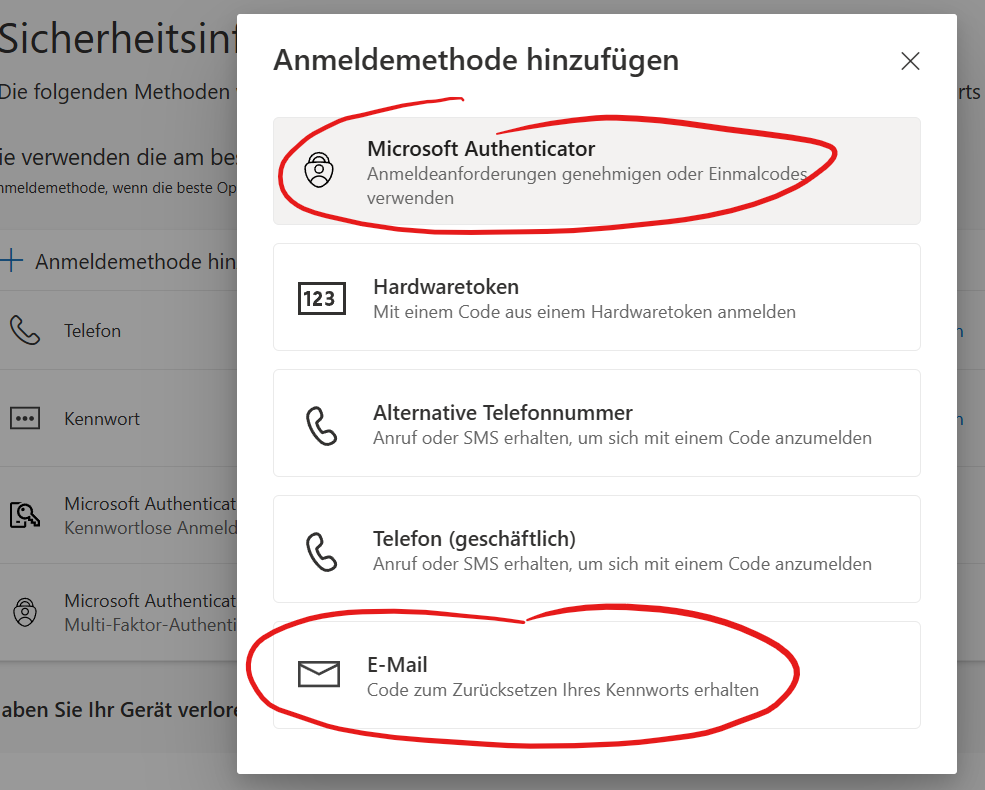

# MFA Problemen vorbeugen

**Ziel ist es, jederzeit Zugriff auf deine Daten und deine Apps zu haben**

Deshalb macht es Sinn, die Mehrfachauthentifizierung sorgfältig einzurichten und zu planen:

1. Richte immer zuerst die Authentifikation über SMS ein
2. Das Smartphone ist ein Klumpenrisiko, geht es verloren, hast du weder über SMS noch die Authenticator-App Zugriff.
3. Richte eine weitere Authentifikationsmethode ein über ein anderes Gerät oder über eine private Mailadresse.

Wenn du bei der Anmeldung an die Schule deine Mobilenummer korrekt angegeben hast, solltest du eine Authentifizierung über SMS besitzen.

Rufe im Browser folgende Seite auf: [Microsoft Konto](https://myaccount.microsoft.com/)

Wähle __Sicherheitsinformationen__ und __Anmeldemethode hinzufügen__

Im sich öffnenden Fenster kannst du die gewünschte Anmeldemethode wählen. Du kannst übrigens die Authenticator App auf einem weiteren Gerät installieren (altes Smartphone, iPad, Android Tablet).

Du wirst anschliessend durch den Anmeldeprozess geführt.

Hier ein Account mit vielen Anmeldemöglichkeiten auch einem iPad:

