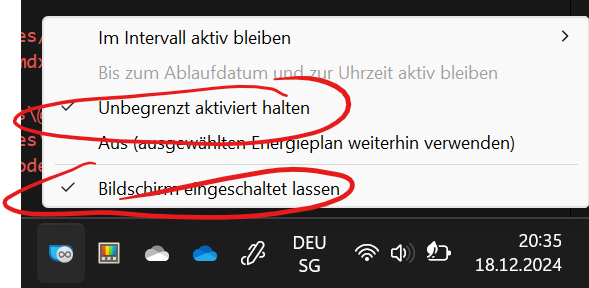
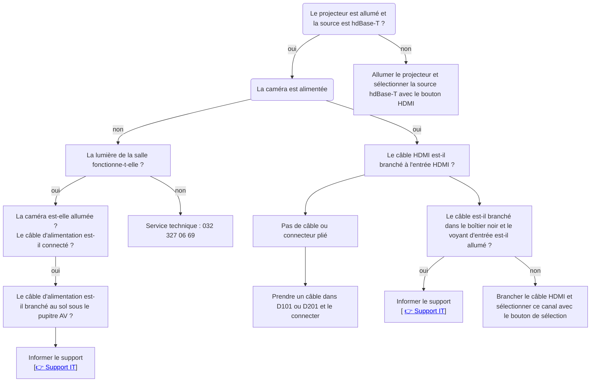
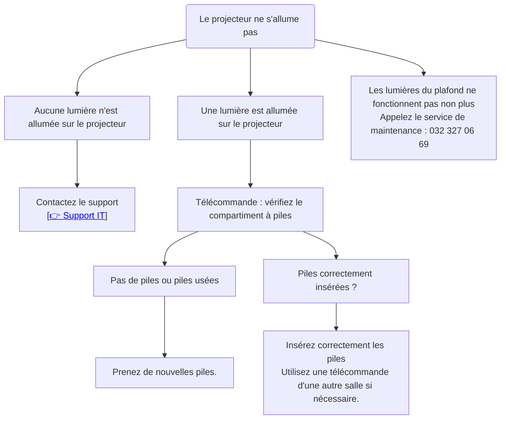

# Guide d'auto-assistance

<Tabs>
  <TabItem value="Mon appareil" label="Mon appareil">

::::info[J'ai des problèmes avec mon compte, Office 365, ou l'authentification]

:::solution[Solution]
Signalez que votre compte doit être réinitialisé. N'oubliez pas de fournir votre adresse e-mail et votre numéro de téléphone portable : [👉 :mdi[emailEditOutline]](mailto:soarhe.jahany@bernedu.ch?subject=Réinitialisation%20du%20compte%20élève&body=Bonjour%20M.%20Jahany,%0A%0AMerci%20de%20réinitialiser%20mon%20compte%20:%0A%0A%40edu.gbsl.ch%0A%0ATel.%2007%0A%0AMerci%20et%20cordiales%20salutations.)
:::
::::

::::info[Je ne peux pas me connecter à Word ou à une autre application]
:::solution[Solution]
L'erreur de connexion peut survenir si la case suivante n'a pas été décochée.

En bas à gauche, cliquez sur __Non, se connecter uniquement à cette application__.
:::
::::

::::info[Je n'arrive pas à me connecter à Internet avec mon MacBook, même si je suis connecté au Wi-Fi]
:::solution[Solution]
1. Installez un autre navigateur (Chrome, Opera, Edge) chez vous ou via un hotspot. Cela vous permettra de vous connecter à Internet à l'école.
2. Vérifiez si vous avez un abonnement iCloud+ et si __Private Relay__ est activé :

Cliquez sur le menu Apple __:mdi[apple]__, sélectionnez __Réglages système__. Cliquez ensuite en haut de la barre latérale sur « [votre nom] » puis sur __iCloud__. Ensuite, cliquez sur __Private Relay__.

Désactivez cette option.

**Qu'est-ce que Private Relay et pourquoi cela pose-t-il problème ?**
Private Relay protège votre identité et vos requêtes en ligne. C'est utile à domicile, mais dans les réseaux bien sécurisés, l'identité contrôlée améliore la sécurité.

La meilleure solution consiste à désactiver __Private Relay__ uniquement pour le réseau Wi-Fi BYOD, tout en maintenant votre sécurité dans les réseaux non sécurisés :

Cliquez sur le menu Apple __:mdi[apple]__, sélectionnez __Réglages système__. Dans la barre latérale, cliquez sur __Réseau__, puis sur __Wi-Fi BYOD__. Cliquez ensuite sur l'icône __:mdi[informationOutline]__.

Enfin, désactivez l'option __Limiter le suivi de l'adresse IP__.
:::
::::

::::info[Wi-Fi]
Problème de **mot de passe** lors de la connexion
:::solution[Solution]
Ne changez pas le mot de passe pendant le processus de connexion au Wi-Fi ! Définissez un nouveau mot de passe ici, valable pour toutes vos connexions à l'école (applications, Wi-Fi, e-mails) : [👉 ](https://password.edubern.ch/)

Si cela ne fonctionne pas, votre compte est peut-être bloqué et doit être réinitialisé. Envoyez un e-mail avec votre adresse e-mail @edu.gbsl.ch et votre numéro de téléphone portable : [👉 :mdi[emailEditOutline]](mailto:soarhe.jahany@bernedu.ch?subject=Réinitialisation%20du%20compte%20élève&body=Bonjour%20M.%20Jahany,%0A%0AMerci%20de%20réinitialiser%20mon%20compte%20:%0A%0A%40edu.gbsl.ch%0A%0ATel.%2007%0A%0AMerci%20et%20cordiales%20salutations.)

Une fois votre compte réinitialisé, vous pouvez définir un nouveau mot de passe [👉 ](https://password.edubern.ch/) et vous reconnecter au Wi-Fi BYOD.
:::
::::

::::info[Mon ordinateur portable Windows passe en veille ou l'écran s'éteint pendant une présentation.]

:::solution[Solution]
Une solution simple et pratique est d'installer __Microsoft PowerToys__ depuis le __Microsoft Store__. Utilisez l'outil __PowerToys Awake__, disponible après l'installation. Configurez-le ainsi :

:::

  </TabItem>
  <TabItem value="Installation D-Gebäude" label="Installation D-Gebäude">
:::info[Ton]
Kein Ton bei einer Präsention, bei einem Film

:::solution[Lösung]
Kontrolliere, ob du den] Ton nicht auf stumm eingestellt hast auf deinem Gerät:

Bild einsetzen

Kontrolliere auf der Fernbedienung des Beamers __Volume__

Bild
:::

:::info[La caméra ne fonctionne pas]

:::solution[Solution]

:::
::::

</TabItem>
<TabItem value="Installation Bâtiment D" label="Installation Bâtiment D">

::::info[Son]
Pas de son pendant une présentation ou un film

:::solution[Solution]
Vérifiez si le son n'est pas coupé sur votre appareil :
  
Insérez une image

Vérifiez également le bouton __Volume__ sur la télécommande du projecteur.  

Insérez une image  
:::
::::
::::info[Le projecteur ne s'allume pas]

:::solution[Solution]

:::
::::

</TabItem>
</Tabs>
